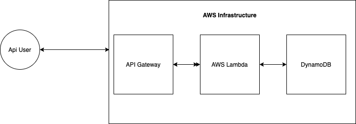

super-formula-interview
------

1. Run functional tests: `yarn test`               // might need to run couple times due to cold start timing issues.
2. Run integration tests: `yarn integrationtest`   // might need to run couple times due to cold start timing issues.

Design/Architectural decisions:
----

1. Functional Test: Test the CRUD functionality against local DynamoDB and Apollo Server
2. Integration Test: Test the CRUD functionality against local SAM deployment of
   lambda and real AWS DynamoDB.
3. Code structure is hopefully self documenting but for posterity:
   /service => has the main business logic.
      /src
         /graphql => schema and resolvers
         /repository => CRUD with DynamoDB + some functions available for testing.
         /index.ts => Lambda handler + Apollo Server integration.
      /test
         /dynamodb_local_latest => local dynamodb artifacts
         /local => Local Apollo Server
         /integration_test.ts => Tests against Local SAM and AWS DynamoDB
         /apollo_server_functional_test => Test the business code against Local DynamoDB and Apollo Server
   /Makefile => has many scripts available for deployment to AWS and other tasks.

How to build / deploy:
---
NOTE: `make` needs to be installed on the machine.

* `build`: `make build`
* `deploy`: `make deploy`
* `unit/functional test`: `make test`
* `integration test`: `make integration_test`

Architecture:
---

Next steps:
---

*  Add implementation for pagination of users.
* Fix functional and integration test for timing issues.
